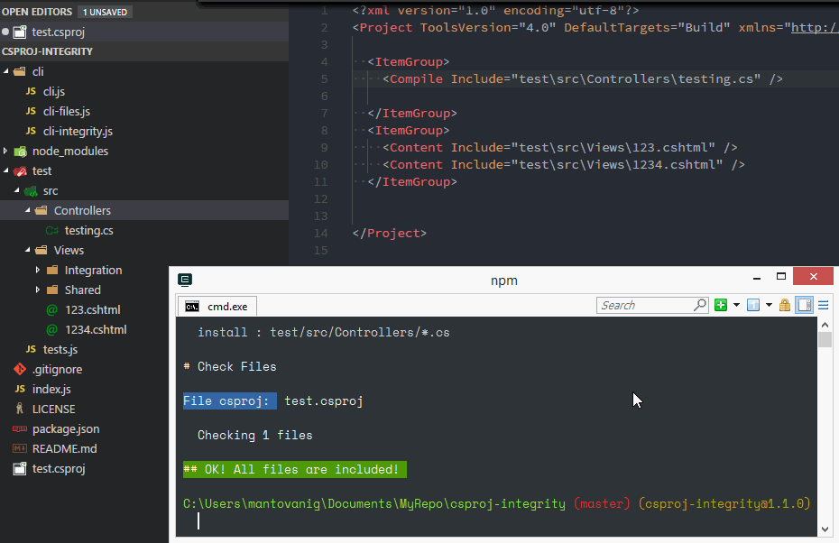
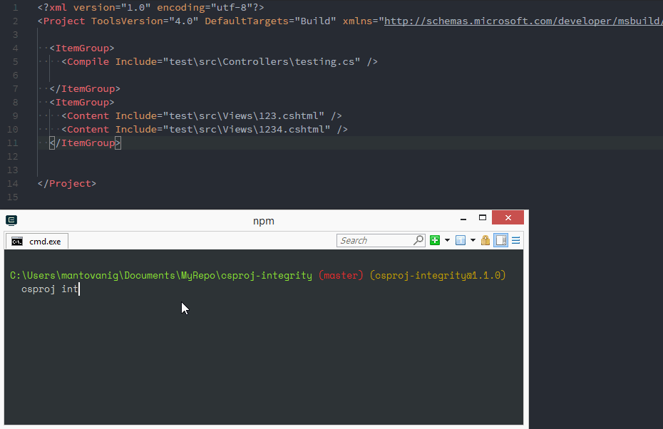

# csproj-integrity  [](https://travis-ci.org/mantovanig/csproj-integrity)
Node module for check the visual studio solution integrity parsing the csproj file.

You can use it with Grunt Plugin [grunt-csproj-integrity](https://github.com/mantovanig/grunt-csproj-integrity)


## CLI commands

Install **csproj** command globally with

```bash
    npm install -g csproj-integrity
```

To check integrity of .csproj file move to the root of the file and run

```bash
    $ csproj integrity
```
To check local files are include in your csproj file run

```bash
    $ csproj files Views/**/*.js Controllers/**/*.cs
```


### **checkFiles**
This task takes an array of path and check if all files are included in the .csproj file.




### **checkIntegrity**
This task check if all file included in the csproj file actually exist.




## As Library

```
$ npm install --save-dev csproj-integrity
```


Usage example
```js
const csproj = require('csproj-integrity');


csproj.checkIntegrity();

csproj.checkFiles(['Views/**/*.cshtml', 'Controllers/**/*.cs']);
```

## TO DO
- [x] Unit test with TAPE
- [x] Check of duplicated
- [ ] Gulp plugin
- [ ] CLI: Option to specify csproj file path
